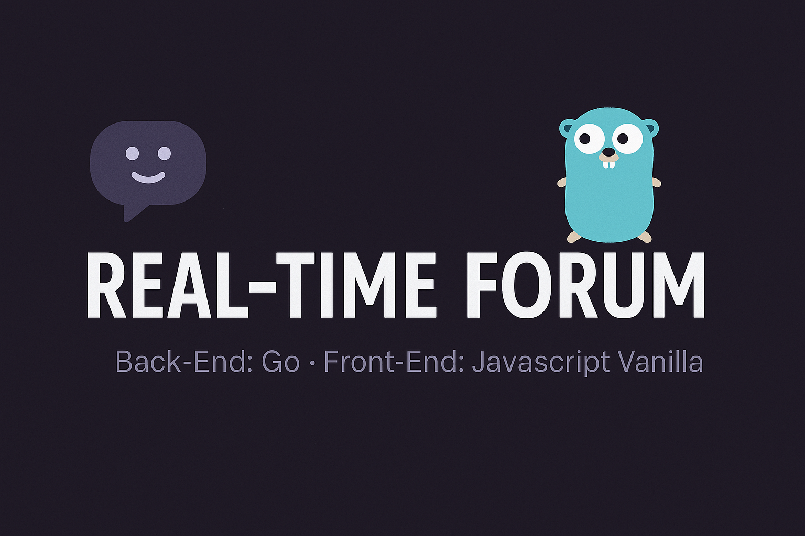

# 🗨️ Real-Time Forum

Un projet de forum en temps réel avec backend en Go et frontend en JavaScript Vanilla, conçu pour apprendre les bases du développement web, les WebSockets, et la manipulation d'une base de données SQLite.

---

## 🚀 Objectifs du projet

Créer un forum fonctionnel qui permet aux utilisateurs de :

- ✅ S'inscrire et se connecter
- ✅ Publier des messages et commenter
- ✅ Envoyer des messages privés en temps réel

---

## 🧩 Fonctionnalités principales

### 🔐 Authentification

- Formulaire d'inscription avec :
  - Surnom
  - Prénom / Nom
  - Âge
  - Genre
  - E-mail
  - Mot de passe (haché avec `bcrypt`)
- Connexion via e-mail ou pseudo + mot de passe
- Déconnexion disponible depuis n'importe quelle page

---

### 📝 Publications

- Création de publications avec catégorie
- Flux de posts visibles sur la page principale
- Affichage des commentaires seulement après avoir cliqué sur une publication
- Ajout de commentaires à une publication

---

### 💬 Messages Privés (Chat)

- Affichage d'une section de chat à tout moment
- Liste des utilisateurs triée :
  - Par date du dernier message
  - Sinon, ordre alphabétique
- Affichage du statut en ligne/hors ligne
- Envoi de messages privés en **temps réel** via WebSockets
- Chargement infini :
  - Les 10 derniers messages au clic
  - +10 messages à chaque scroll vers le haut (avec throttle/debounce)
- Format du message :
  - Date d'envoi
  - Nom d'utilisateur
  - Contenu

---

## 🧱 Stack Technique

### Backend (Go)

- 📦 Websocket Gorilla
- 📦 sqlite3
- 📦 bcrypt
- 📦 uuid (gofrs/uuid ou google/uuid)

### Frontend (JavaScript Vanilla)

- HTML/CSS + JavaScript sans frameworks
- Gestion du DOM
- Connexions WebSocket natives
- Manipulation des événements (scroll, debounce, throttle)

---

## ⚙️ Lancement du projet

### 1. Cloner le dépôt

```bash
git clone https://github.com/BrendieD24/real-time-forum.git
cd real-time-forum
```
2. Lancer le backend (Go)
Assurez-vous d’avoir Go installé.

Dans le terminal

```bash
go run main.go
```

📚 Ce que vous apprendrez
Gestion des sessions et cookies

Utilisation de WebSockets (Go + JS)

HTML/CSS/JS (sans frameworks)

Gestion d’une base SQLite en Go

Développement d’applications temps réel

Structuration d’un projet backend + frontend

✅ Paquets autorisés
Tous les packages standards de Go

Gorilla WebSocket

bcrypt

sqlite3

uuid (gofrs ou google)

❌ Pas de frameworks frontend (React, Vue, Angular, etc.)

🛠️ À venir
✅ Système de likes sur les publications

⏳ Notifications système

⏳ Recherche de messages / utilisateurs

📄 Licence
Ce projet est libre d'utilisation pour un usage éducatif.

## 👨‍💻 Auteur

Réalisé par brendie Delamare et Mohammed Soumare dans le cadre d’un exercice de ma formation chez Zone01, afin d’approfondir mes connaissances en développement web en temps réel.

[brendie Delamare](https://github.com/BrendieD24)
[Mohammed Soumare](https://github.com/Salinkcha)

